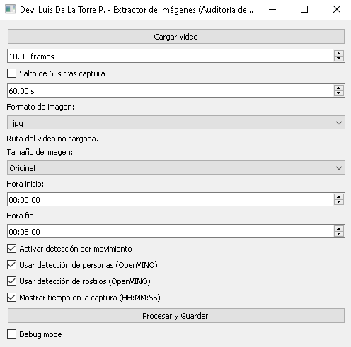

# Detección de Movimiento en Videos largos con Inteligencia Artificial

Herramienta en Python para analizar videos y extraer automáticamente imágenes relevantes utilizando detección de movimiento y modelos de inteligencia artificial.

El programa permite revisar grabaciones largas de forma rápida y guardar solo los frames donde ocurre algo importante, como movimiento, presencia de personas o detección de rostros.

El proyecto utiliza OpenCV para el procesamiento de video y OpenVINO para ejecutar modelos optimizados de detección.

## Captura de la aplicación

## Características

- Extracción automática de imágenes desde video
- Detección de movimiento usando MOG2
- Detección de personas mediante modelo OpenVINO
- Detección de rostros mediante modelo OpenVINO
- Interfaz gráfica desarrollada con PyQt5
- Posibilidad de elegir intervalo de frames
- Redimensionado automático de imágenes
- Marca de tiempo en las capturas (timestamp)
- Sistema opcional de salto de tiempo después de cada captura

## Tecnologías utilizadas

- Python
- OpenCV
- OpenVINO
- NumPy
- PyQt5

## Instalación

### 1. Clonar el repositorio

git clone https://github.com/luisdl-dev/video-mov-deteccion.git

Entrar a la carpeta del proyecto:
cd video-mov-deteccion

### 2 Instalar dependencias

pip install -r requirements.txt

## Modelos de Inteligencia Artificial

El programa utiliza modelos preentrenados de OpenVINO para detectar personas y rostros.

Verifica o coloca los siguientes archivos dentro de la carpeta:
models/

Archivos requeridos:
person-detection-retail-0013.xml
person-detection-retail-0013.bin
face-detection-retail-0005.xml
face-detection-retail-0005.bin

## Ejecutar la Aplicación

Desde la carpeta principal del proyecto ejecutar:
python src/main.py

Esto abrirá la interfaz gráfica de la aplicación.

## Posibles usos

Auditoría de grabaciones CCTV
Revisión rápida de videos largos
Extracción de eventos importantes en grabaciones
Generación de datasets para entrenamiento de modelos de visión artificial

## Autor

Luis de la Torre Palomino

Desarrollador autodidacta interesado en visión por computadora, automatización y herramientas basadas en inteligencia artificial.

GitHub:

https://github.com/luisdl-dev